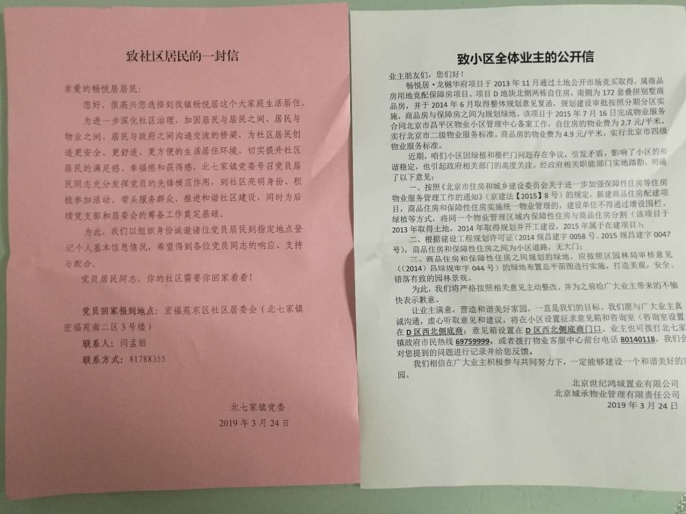
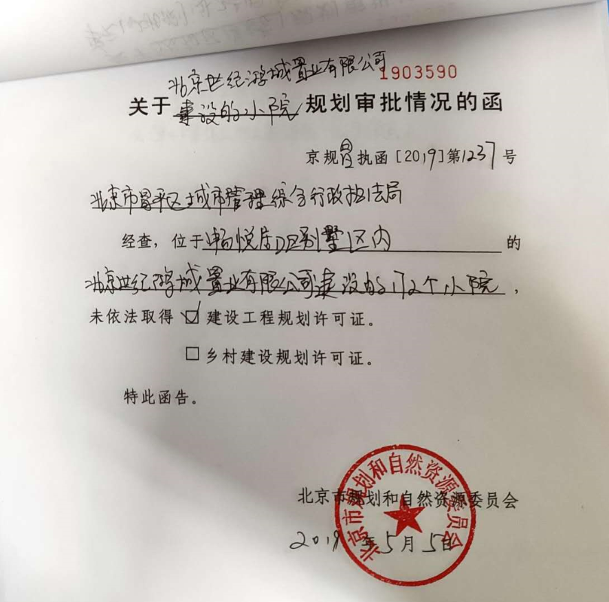
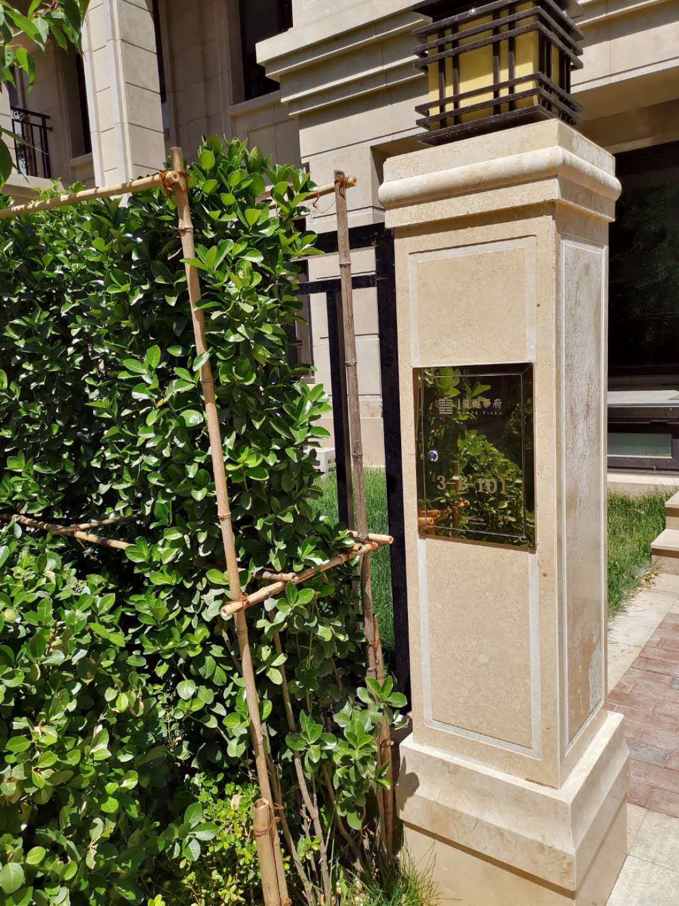
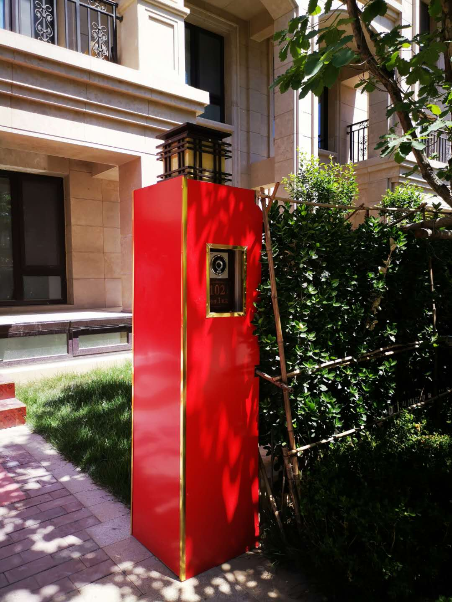
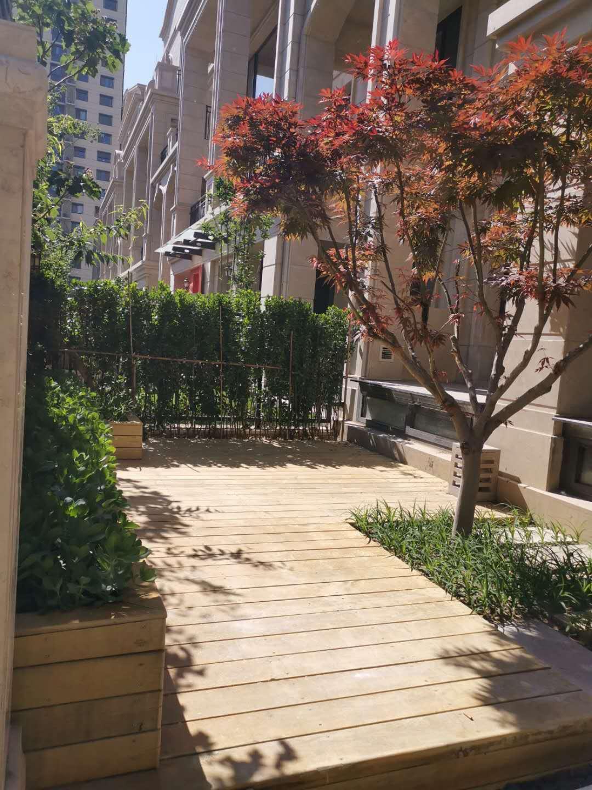
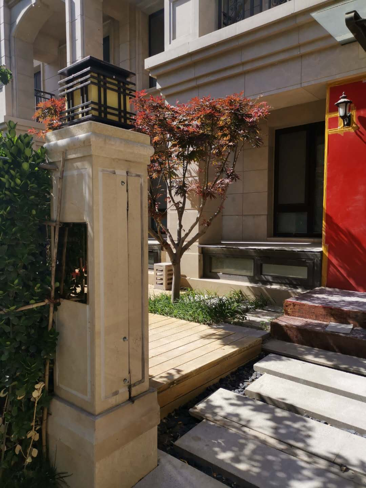
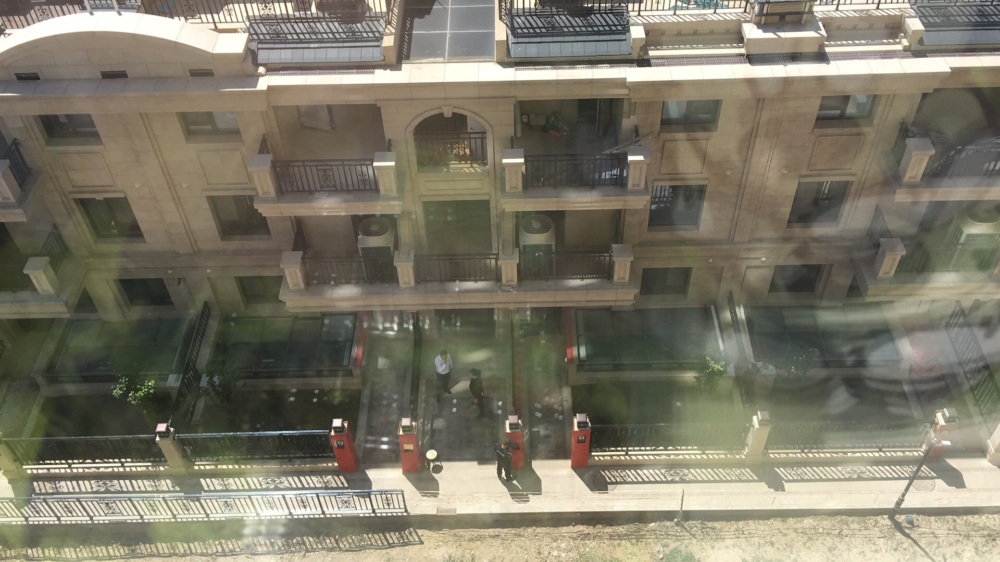

# Beijing Illegal Building Information

**坐标：北京市昌平区北七家镇平西府中路1号院D区**

# **2014年规划相关文件**

昌绿规审字044-D区叠拼与自住之间.jpg)

昌绿规审字044绿地备案文件.png)

规划图1.png)

## 2019年开发商无视国家法律

## 违建绿化都变成菜园子铺地板了

## 信访答复意见书

![昌建网信答字[2019]72号信访答复意见书1.jpg](昌建网信答字[2019]72号信访答复意见书1.jpg)

![昌建网信答字[2019]72号信访答复意见书2.jpg](昌建网信答字[2019]72号信访答复意见书2.jpg)

![昌建网信答字[2019]72号信访答复意见书3.jpg](昌建网信答字[2019]72号信访答复意见书3.jpg)

## 附录：畅悦家园隔离情况说明

[畅悦家园隔离情况说明.docx](畅悦家园隔离情况说明.docx)

